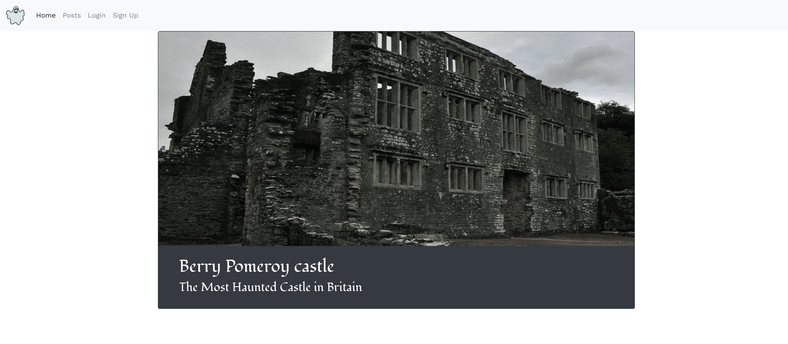

## Haunted Places App 

client repo: https://github.com/jishan33/Haunted-Places-Client

server repo: https://github.com/jishan33/Haunted-Places-App

## instruction to setup
react 
- yarn install

rails 
- bundle install 
- rails db:create

## Description 
 
An app allows users with interests in mysterious locations and events to share their posts and form an online community. 

